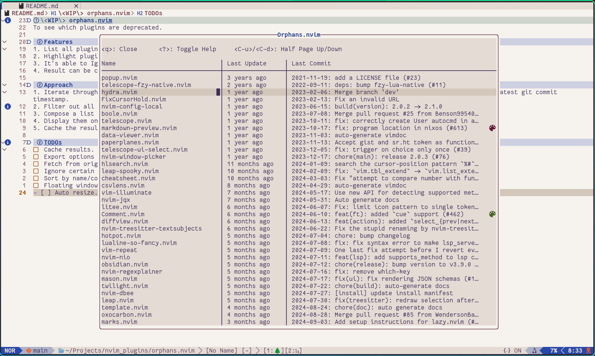

# Orphans.nvim
Track neglected plugins and rediscover the overlooked in your Neovim setup.


## Features
1. List all plugins ordered by the latest update time. 
2. Highlight plugins that are not maintained actively. (coming soon)
3. It's able to Ignore certain plugins. (coming soon)
4. Result can be cached. (coming soon)

## Installation
Use `lazy.nvim` to install the plugin:
```lua
{
    "ZWindL/orphans.nvim",
    config = function()
        require('orphans').setup({})
    end
}
```
## Usage
Use `:Orphans` to list all plugins.

Currently, `orphans` has its limitation. It will not pull the latest commit info from GitHub, so you need to update the plugin manually using whatever plugin manager.

## Approach
1. Iterate through all `rtp` directories one by one, check if it's a git repo, has either `lua/` or `plugin/`, then retrieve the latest git commit timestamp.
2. Filter out all plugin dirs and combine the meta info (date time, name, commit message, etc.)
3. Compose a list of all plugins and sort them lively while retrieving the info of the remaining plugins.
4. Display them on a floating window. Expand one item for more details.
5. Cache the result.

## TODOs
- [ ] Cache results.
- [ ] Export options for progress bar UI.
- [ ] Fetch from origin automatically.
- [ ] Ignore certain plugins.
- [ ] Sort by name/commit time.
